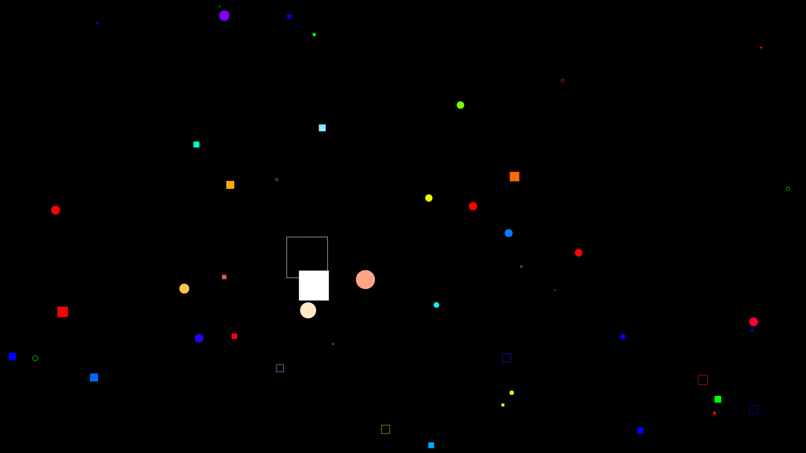

# Particles

Particles from HTML canvas

Particles are represented by circles and squares. When the mouse cursor approaches them, their size increases.

## How to Use

1. Clone this repository.
2. Open `index.html` in your browser.
3. Move your mouse cursor around the canvas to interact with the particles.

## Features

- Responsive to mouse movement.
- Visually appealing particle effects.
- Easily customizable.
